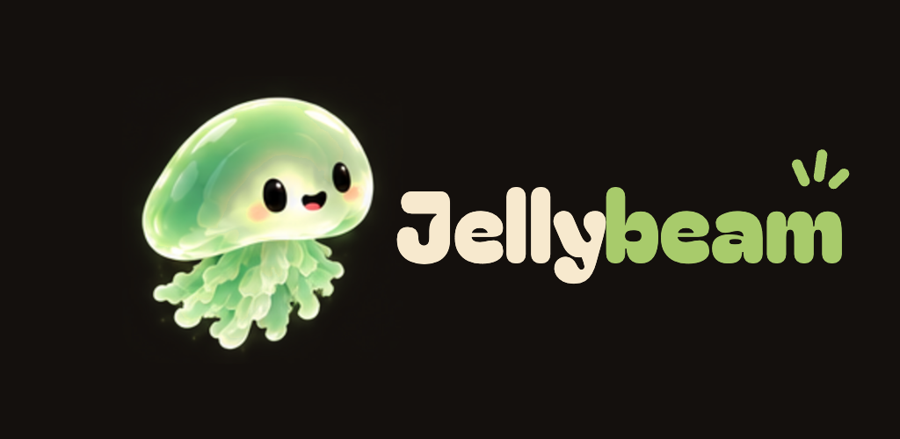

<div align="center">



### Built in Rust. Native to Apple Silicon. Really, really fast.

<a href="https://github.com/packetinspector/jellybeam-macos/releases/latest"></a>     

</div>

<br>

A Jellyfin client for the Mac with no web view inside it. The interface is Rust drawing straight to Metal through [GPUI](https://www.gpui.rs). The player is [libmpv](https://mpv.io) rendering into a layer the app owns. Your library sits in a SQLite mirror on disk, so mirrored libraries stay quick to browse while sync runs in the background.

## Jellybeam Features

- **100% Rust, no web shell.** No Chromium, no Qt WebEngine, no Flutter, no Electron. Every line of Jellybeam is Rust, and every screen is drawn on the GPU by [GPUI](https://www.gpui.rs).
- **Native, all the way down.** A real `.app` with a Metal-backed window, VideoToolbox decoding, EDR output for HDR, media keys, Now Playing, native fullscreen. It behaves like a Mac app because it is one.
- **Built for fast browsing.** Cached home shelves, library grids and search use a local SQLite mirror. Performance instrumentation and budgets cover launch, navigation, search and scrolling; results depend on the Mac and library.
- **Browse from the local mirror.** Home, grids, seasons, search, sort and filter use cached metadata. Background sync and WebSocket updates keep it current. Initial sync, plugin channels and Discover need the server.
- **Direct Play as far as it goes.** HEVC 10-bit 4K, AV1, VP9 and ProRes through mpv, with VideoToolbox where the hardware supports the stream and software decoding otherwise. TrueHD, DTS, AC3, E-AC3, FLAC and Opus decoded locally. The device profile tells the server what the Mac can really play, so it stops transcoding files that never needed it.
- **HDR that lands on the display.** HDR10 and HLG tone-mapped into macOS EDR headroom. XDR displays get real HDR.
- **Subtitles done properly.** ASS/SSA through libass, PGS, SRT and VTT, embedded or sidecar, composited on the GPU, with style overrides for the ones that need them.
- **Browse while it plays.** The video is a node in the scene, not a window. Escape steps it down a layer at a time, from fullscreen to a miniplayer in the corner, while you look for the next thing.
- **Seerr is built in.** Connect Jellyseerr or Overseerr once and Discover appears in the sidebar: trending, upcoming, search, request.
- **Nothing phones home.** No analytics, no crash SDK, no telemetry. A log file in your Library folder, and that's it.

<br>

## Speed


- **Updates in the background.** WebSocket events and periodic reconciliation bring library changes and watched state into the mirror.
- **Play is prefetched.** Hover a card and the playback handshake is done before you click.
- **Preload over slow links.** Speculative playback setup and a tuned demuxer reduce the work left when you press Play.
- **Dead hostnames get remembered.** If your server's name resolves slowly or not at all, the last good address is used while the resolver catches up.
- **Sync while you browse.** Library scans run in the background while navigation reads the local mirror.
- **Measure your build.** `JELLYBEAM_PERF=1` records launch, navigation, search and render intervals against the budgets in [docs/OVERVIEW.md](docs/OVERVIEW.md). Render intervals do not measure compositor frame delivery.

<br clear="right">

## The player


- **An OSD that gets out of the way.** Auto-hides, comes back on a nudge, and shows the codec strip, chapter ticks and trickplay previews while you scrub.
- **Skips per segment type.** Intro, recap, preview, commercial and credits each get Ask, Auto-skip or Off.
- **Next up that knows where the credits are.** The next-episode card counts down from the show's own credits marker, not a fixed offset from the end of the file.
- **Per-series track memory.** Pick an audio or subtitle track once and the series remembers it.
- **Media keys and Now Playing.** Play, pause, skip and scrub from the keyboard's media keys or Control Center.
- **Native fullscreen.** And a keyboard for everything: `?` shows every shortcut.
- **Transcoding is a setting, not a surprise.** Direct Play refuses rather than downgrading. Bitrate caps are per server and opt-in, and the OSD says `TRANSCODE` and why.

<br clear="right">

## The craft


- **Names are yours.** Servers, libraries and items appear exactly as you named them. Nothing gets prettified.
- **Multiple servers, multiple users.** Sign in with a password or Quick Connect. Switch without signing out.
- **Plugin libraries just work.** A TVHeadend recordings library, or any other plugin channel, lists and plays like anything else.
- **Grid or list, your call.** Per library, remembered across restarts. Sorting uses the server's own sort names, so "The" and leading numbers behave.
- **Watched state that catches up.** Mark something played on another device and the Mac reconciles it at launch and on reconnect.
- **Progress reporting with recovery.** Stop reports retry for a bounded period. Quit-time reports are saved for replay on the next launch.
- **A mascot with manners.** It greets you in the sidebar, keeps you company on an empty library or a pairing screen, and never covers your posters.
- **Local diagnostics.** Logs live in `~/Library/Logs/Jellybeam/`. They can contain server addresses, titles, paths and error details; review and redact them before sharing.

<br clear="right">

## Install

Download `Jellybeam.zip` from the [latest release](https://github.com/packetinspector/jellybeam-macos/releases/latest), unzip it, and drag `Jellybeam.app` to Applications. Type your server address, then sign in with a password or Quick Connect.

Releases are not yet notarized by Apple, so macOS blocks the first launch. Open the app once, then go to System Settings → Privacy & Security and choose **Open Anyway**. Or clear the download flag from Terminal:

```sh
xattr -dr com.apple.quarantine /Applications/Jellybeam.app
```

Requirements: an Apple Silicon Mac on macOS 13 or later, and a Jellyfin server on 10.11 or newer. Updates are installed manually from Releases; the About window links there.

## Build it yourself

Xcode Command Line Tools, Rust (pinned by `rust-toolchain.toml`), and Homebrew for the media-stack build tools.

```sh
brew install meson ninja nasm cmake automake autoconf pkg-config
scripts/build-vendor.sh   # once: libmpv + FFmpeg + libplacebo + libass into vendor/
cargo build -p app        # the jellybeam binary
scripts/bundle-app.sh     # a self-contained Jellybeam.app in target/bundle/
```

[docs/START-HERE.md](docs/START-HERE.md) is the map, [docs/BUILD.md](docs/BUILD.md) has the vendored build and signing, [CONTRIBUTING.md](CONTRIBUTING.md) has the gates.

## Something broke

Open an [issue](https://github.com/packetinspector/jellybeam-macos/issues/new/choose). Include your macOS version, Jellyfin version and the log from `~/Library/Logs/Jellybeam/`; skim it for anything you'd rather not post first.

<br>

<div align="center">


<sub>GPL-3.0-or-later. The Jellybeam name, wordmark and mascot are reserved; see <a href="TRADEMARKS.md">TRADEMARKS.md</a>. Jellybeam is an independent project, not affiliated with Jellyfin.</sub>

</div>
